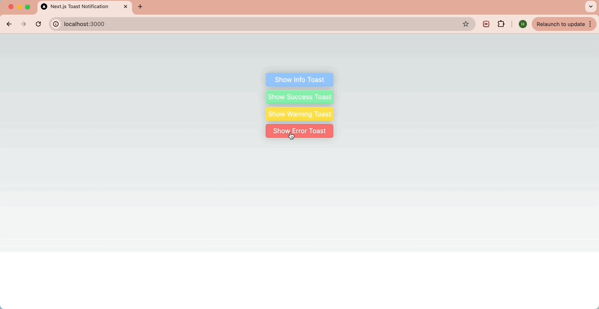

# Next.js App with Toast Notifications
This repository hosts a sample Next.js app that uses `createPortal` for custom toast notifications. Blog article for 

## Run the app
To spin up the development server, follow these steps:

1. Install the dependencies:
  ```bash
  npm install
  ```
2. Start the development server:
  ```bash
  npm run dev
  ```
3. Open [http://localhost:3000](http://localhost:3000) with your browser to see the result.

## App in Action
Here's a preview of the toast notifications in action:


## Learn More
For a detailed guide on implementing toast notifications in a Next.js project, check out my [blog article](https://hkim-dev.github.io/frontend/Creating-Toast-Notifications-in-a-Next.js-Project-with-createPortal/).
